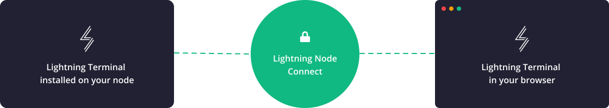

# Lightning Node Connect (LNC)

Secure, private access to a Lightning node over an untrusted web server.
LNC leverages [Password Authenticated Key Exchange
(PAKE)](https://en.wikipedia.org/wiki/Password-authenticated_key_agreement) and
macaroon-scoped gRPC connections to enable developers/users a trust-minimized
application experience. LNC removes various network obstructions (NAT etc.) to
provide disintermediated access to user-run Lightning Network infrastructure and
app UX.

Lightning Node Connect improves on prior trust/access efforts at solving this
problem (like [LND Connect](https://github.com/LN-Zap/lndconnect)) by using a
PAKE instead of manually managing TLS certificates and macaroons. Lightning Node
Connect's PAKE is combined with the [Noise Protocol
Framework](http://noiseprotocol.org/noise.html) to create a pairing flow where a
user only needs to enter a short human-readable passphrase (scan or click a
link) to establish a secure end-to-end encrypted/mutually-authenticated
connection with an application. LNC uses macaroons to allow users to set a
granular set of capabilities a remote website/application is able to access.

LNC leverages Go’s excellent WASM toolchain in order to allow browsers to
securely connect to a remote Lightning Node. This WASM integration will allow
for richer web-based Lightning applications, which are a necessary component to
realize the Lightning Native Web.

[Read the full LNC launch blog post
here](https://lightning.engineering/posts/2021-11-30-lightning-node-connect-deep-dive/).

## Components

LNC is a secure connection protocol for bridging the gap between any Lightning
node and the web. It is designed to work with any Lightning Network
implementation but this reference project is built to work with [Lightning
Terminal](https://github.com/lightninglabs/lightning-terminal) /
[`lnd`](https://github.com/lightningnetwork/lnd) specifically.

The following Open Source (MIT licensed) components are required to build a
secure LNC connection:

* [Lightning Terminal (LiT)](https://github.com/lightninglabs/lightning-terminal)
  provides a UI for creating and managing LNC sessions. A session is a
  time-limited, permission-scoped connection authorization that is identified by
  a 10 word mnemonic pairing phrase.
  Once a session is created in LiT, an outbound connection to the mailbox proxy
  is established from LiT, waiting for a handshake with a browser. This allows
  a connection to be made to a LiT node that is behind a firewall/NAT or even
  Tor-only internet connection.
* A mailbox proxy (built into
  [aperture](https://github.com/lightninglabs/aperture)): A simple public
  mailbox server that acts as a
  [TURN](https://en.wikipedia.org/wiki/Traversal_Using_Relays_around_NAT) relay.
  The mailbox proxy/relay simply offers a buffered (hence the term "mailbox")
  one-way connection stream. A stream is identified by a 512-bit ID which is
  derived from the LNC pairing phrase. This makes it virtually impossible for
  anyone to occupy a stream they weren't authorized to. And the added PAKE/Noise
  encryption layer prevents anyone (including the mailbox proxy) from listening
  in on the content.
* A WASM client embedded in a website: The [WASM reference client provided in
  this repo](cmd/wasm-client/main.go) is the component that allows JavaScript
  embedded in a website (such as [Lightning
  Terminal](https://terminal.lightning.engineering/)) to communicate with a
  mailbox proxy over WebSockets using the PAKE/Noise encryption protocol. [An
  example HTML page](example/README.md) shows how the WASM binary can be used
  by JavaScript to initiate a connection and issue gRPC requests.

